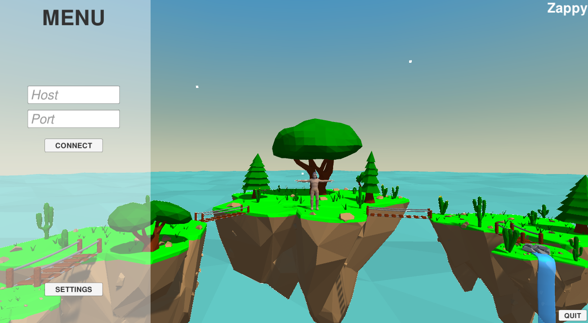
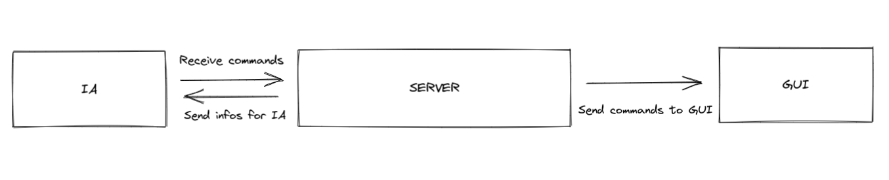
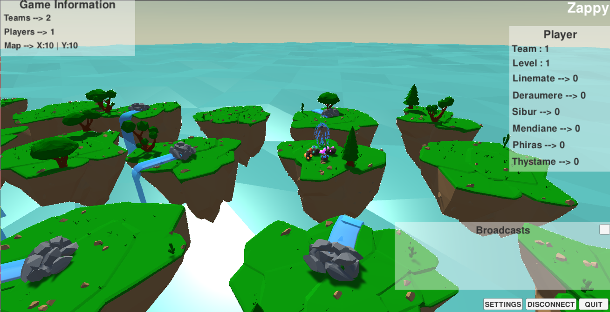

# Zappy :zap:

Zappy is the final project made in our second year in Epitech. The goal of this project is to create a network game. Several teams confront on a tiles map containing resources. The winning team is the one with 6 players who reached maximum elevation.



This project requires a lot of work during 4 weeks. Time management must be well thought out in order to complete this project on time!

## Description :sunrise_over_mountains:

The Zappy consists of three different parts:
- Server (Written in C)
- GUI (Written in C# with Unity Engine)
- AI (Written in Python3)

First, we start the server to which we can connect the GUI that will ask for the necessary information to display the corresponding game objects. Then the AIs which are also clients will connect with a different protocol from the GUI, and will be able to perform actions, and adapt themselves according to the answers of the serv




 
## Server

The server controls the data, and sends the information requested by the different clients.\
It uses the TCP protocol, and has been developed in a non-blocking way and able to manage several connections using ``select``. In addition, several good practices have been implemented such as the management of transmitted data using buffers.

It consists of a network layer that handles the clients, and a business layer that handles the players. The separation of these two layers allows a total modularity of each part. 

## GUI

To have a better vision of the game, which is simple, clear and ergonomic, we made a user interface with the Unity engine.

In the game, you can see the different islands that represent the tiles of the map. Each island contains food and minerals. The players move between the islands to collect resources. In real time, the information of the map are displayed, as well as the broadcast of the players that can be deciphered. By clicking on the islands or players, we can see what they contain (resources, inventory, …)




## Client A.I

Each player of the game is by default inactive, to animate a player the artificial intelligence must take possession of it. To do this, it must communicate with the server and send it precise instructions. Its objective: reach level 8 as soon as possible!

The AI engine is based on a shared inventory algorithm that allows all players in the team to know the resources needed for the incantation.

We use a non-blocking architecture with a circular buffer allowing the data to be stored while performing the optimal actions

```py
def connect_to_server(self):
    self.socket = socket.socket(socket.AF_INET, socket.SOCK_STREAM)
    self.socket.setblocking(False)
    self.socket.connect_ex((self.hostname, safe_cast(self.port, int)))
    events = selectors.EVENT_READ | selectors.EVENT_WRITE
    self.selectors.register(self.socket, events)
```

## Installation :mag_right:

I advise you to use a virtual environment for python dependencies

```
pip3 install -r requirements.txt
```

## Start project :checkered_flag:

Launch the server

```
./zappy_server -p port -x width -y height -n name1 name2 ... -c clientsNb -f freq
```

Launch the GUI 

```
./zappy_gui
```

Launch the AI, it will next create one process per instance.

```
./zappy_ai -p port -n name -h machine
```

Now all you have to do is enjoy, and watch the AIs race for resources :)\
For more information, the documentation is available [here](https://zappy.readthedocs.io/en/latest/)

## Results :trophy:

|                          Misc.                        |      Mark       |
|:----------------------------------------------------------:|:------------------:|
|           Preliminaries | 2 / 2 |
| Documentation    | 2 / 3        |


|                          Server                        |      Mark       |
|:----------------------------------------------------------:|:------------------:|
|           Run Forever | 0 / 1 |
|  select/poll/epoll usage   | 1 / 1        |
| Buffers           | 1 / 4        |
| Network Buffer Tests | 1.5 / 1.5  |
|Network Load Tests|2.5 / 4|
|Layered Architecture|2 / 3|
|Error management | 2 / 3 |
|Parameters | 2 / 3 |
|Protocol | 3 / 3 |
|Time management | 2 / 2 |

|                          GUI                        |      Mark       |
|:----------------------------------------------------------:|:------------------:|
|           What is the GUI ? | 3 / 3 |
| Buffer / Select   | 2 / 2        |
| Menu          | 3 / 3        |
| Map | 5 / 6  |
|Informations| 4 / 4|
|Interactions|5 / 6|

|                          AI                        |      Mark       |
|:----------------------------------------------------------:|:------------------:|
|           Preliminaries | 1 / 1 |
| Buffer / Select    | 2 / 2        |
| Algo           | 2 / 3        |
| Communication | 2 / 4  |
|Level| 8 / 8|

The final test was to reach the maximum level in 10 minutes, we reached it in about 30 seconds, so we can say: successful challenge! :trophy:

## Bonus :package:

As a bonus, we have developed a mobile application that integrates the graphic client in augmented reality. The phone connects like a classic client on the network to communicate with the server on the machine.

A video of presentation is available [here](https://www.youtube.com/watch?v=DI_l7lQiE4U) :star:


------------
## Maintainers :sunglasses:

 - [Mikaël Vallenet](https://github.com/Mikatech) - Client TCP A.I
 - [Yannick Ferrard](https://github.com/YannickTektek) - Client TCP A.I
 - [Nolann Sabre](https://github.com/Mikatech) - Server TCP
 - [Ahmed Abouelleil-sayed](https://github.com/AhmedFr) - Server TCP
 - [Maxime Premont](https://github.com/MaximePremont) - Client TCP GUI
 - [Lucien Carneiro](https://github.com/lucien-carneiro) - Client TCP GUI
